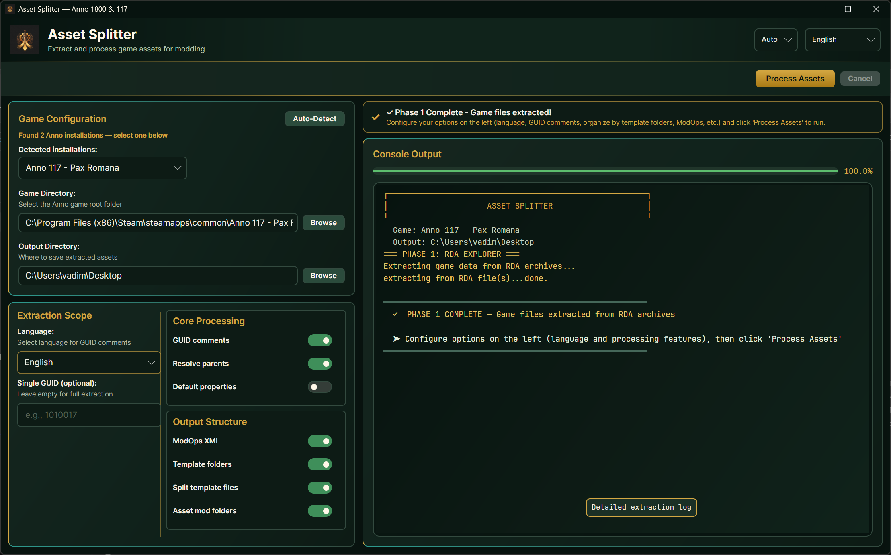
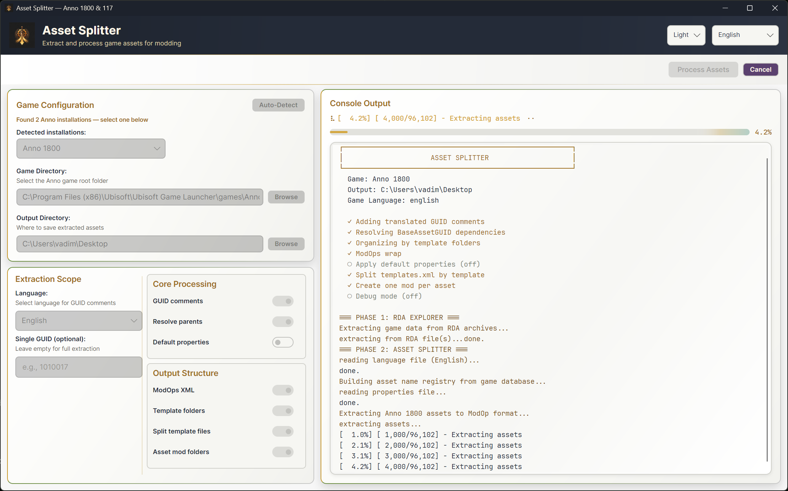

<p align="center">
  
</p>

<h1 align="center">Asset Splitter UI</h1>

<p align="center">
  A Windows desktop tool for extracting <strong>Anno 1800</strong> and <strong>Anno 117: Pax Romana</strong> assets and turning them into mod-ready XML.
</p>

<p align="center">
  
  
  
  
  
</p>

---

## Download

Download the latest build from **[Releases](https://github.com/Gosolceser1/Asset-Splitter-UI/releases)**.

| Package | Best for | Requirement |
|---------|----------|-------------|
| `Asset-Splitter-UI-v1.0.0-win-x64-self-contained.zip` | Most users | No separate .NET install |
| `Asset-Splitter-UI-v1.0.0-win-x64-framework.zip` | Smaller download | [.NET 10 runtime](https://dotnet.microsoft.com/download/dotnet/10.0) |

Unzip the package and run **`AssetSplitterUI.exe`**.

---

## What It Does

Asset Splitter UI reads Anno game archives, extracts the source XML database, and creates easier-to-use XML files for modding.

It can:

- Detect installed Anno 1800 and Anno 117 games.
- Extract source XML from `.rda` archives.
- Split the large game `assets.xml` into one XML file per asset.
- Add translated GUID comments.
- Resolve `BaseAssetGUID` inheritance.
- Export ModOps XML.
- Create Mod Loader folders with `modinfo.json`, short `README.md`, `MODDING-GUIDE.md`, and `assets.xml`.
- Process the full game database or one specific GUID.

It does not include or distribute Ubisoft game files. You need your own installed copy of a supported game.

---

## Supported Games

| Game | Output root | Generated Mod Loader asset path |
|------|-------------|---------------------------------|
| Anno 1800 | `AnnoAssets/Anno1800/` | `data/config/export/main/asset/assets.xml` |
| Anno 117: Pax Romana | `AnnoAssets/Anno117/` | `data/base/config/export/assets.xml` |

Anno 1800 and Anno 117 use different Mod Loader rules. Generated docs are written for the selected game (`MODDING-GUIDE.md` + short per-mod README), so users do not have to guess paths or ModOp style.

---

## Quick Start

1. Run **`AssetSplitterUI.exe`**.
2. Choose or auto-detect your Anno game installation.
3. Choose an output directory with plenty of free space.
4. Click **Extract Assets** to create the source XML cache.
5. Choose processing options.
6. Click **Process Assets**.
7. Open the output folder and use the generated XML or mod folders.

The first extraction for a game can take a while and can create many files. Later runs can reuse the extracted source XML and go straight to processing.

---

## Features

| Feature | What it is for |
|---------|----------------|
| GUID comments | Adds translated asset names beside GUID values. |
| Resolve parents | Merges inherited `BaseAssetGUID` properties into output assets. |
| Default properties | Adds missing template defaults during processing. |
| ModOps XML | Wraps output in Mod Loader `ModOp` XML. |
| Template folders | Groups full extraction output by asset template. |
| Split template files | Exports template reference XML files. |
| Asset mod folders | Creates one Mod Loader folder per asset. |
| Single GUID | Processes one numeric GUID instead of the full database. |

Other useful UI features:

- Game language selection for GUID comments.
- UI language selection.
- Light, dark, and auto theme modes.
- Recent game/output paths.
- Per-game console state when switching between detected installations.
- Cancel button for extraction or processing.
- Developer/debug mode for troubleshooting.

---

## Single GUID Mode

Use **Single GUID** when you want to inspect, test, or export one asset instead of processing the whole game.

How it works:

- The field unlocks only after source XML exists for the selected game.
- The UI checks the typed GUID against that game's `assets.xml`.
- If found, it shows the resolved asset name and template type.
- Processing writes only that GUID into separate single-GUID folders.
- Re-running the same GUID replaces only that GUID's folder.
- Running another GUID creates another folder beside it.

Example:

```
AnnoAssets/
└── Anno117/
    ├── single_guid_output_xml_anno117/
    │   └── 1010017 - Denarii/
    │       └── 1010017 - [Denarii].xml
    └── single_guid_mods/
        └── 1010017 - Denarii/
            ├── modinfo.json
            ├── README.md
            └── data/base/config/export/assets.xml
```

Full extraction output and single-GUID output are separate, so testing one asset does not overwrite a full extraction.

---

## Output Folders

All output is placed inside `AnnoAssets` under the output directory you choose.

```
YourOutputFolder/
└── AnnoAssets/
    ├── Anno1800/
    │   ├── source_xml_anno1800/
    │   ├── output_xml_anno1800/
    │   ├── output_xml_anno1800_mods/
    │   ├── output_templates_anno1800/
    │   ├── single_guid_output_xml_anno1800/
    │   └── single_guid_mods/
    └── Anno117/
        ├── source_xml_anno117/
        ├── output_xml_anno117/
        ├── output_xml_anno117_mods/
        ├── output_templates_anno117/
        ├── single_guid_output_xml_anno117/
        └── single_guid_mods/
```

| Folder | Purpose |
|--------|---------|
| `source_xml_{game}` | Raw XML database extracted from RDA archives. |
| `output_xml_{game}` | Full processed XML output. |
| `output_xml_{game}_mods` | Full-run Mod Loader folders. |
| `output_templates_{game}` | Template reference XML files. |
| `single_guid_output_xml_{game}` | XML output for individual GUID runs. |
| `single_guid_mods` | Mod Loader folders for individual GUID runs. |

Full output folders are best for browsing and larger modding work. Single-GUID folders are best for focused experiments and small test mods.

### Source XML Cache

The `source_xml_{game}` folder is created by **Extract Assets** and reused by later processing runs. It contains:

- `assets.xml` — the main asset database.
- `templates.xml` — asset template definitions.
- `properties.xml` and game-specific property files.
- `datasets.xml` — shared dataset definitions.
- `texts_*.xml` — in-game text databases used for GUID names and comments.

Typical extracted source sizes:

| Game | Typical source files | Approximate size | Notes |
|------|----------------------|------------------|-------|
| Anno 1800 | 16 files | About 380 MB | Includes a very large `assets.xml` and 11 language files. |
| Anno 117 | 18 files | About 110 MB | Includes `properties-meta.xml`, `audio_generated.xml`, and 12 language files. |

Keep this folder if you want faster later processing. Delete it only when you want to force a fresh extraction from the game archives.

---

## Generated Mod Folders

When **Asset mod folders** is enabled, the tool creates Mod Loader folders that include:

- `modinfo.json`
- A short per-mod `README.md` (quick steps for that asset)
- `assets.xml` in the correct game-specific path

The export root also contains:

- `README.md` — export summary and where to start
- `MODDING-GUIDE.md` — full Mod Loader guide (written once per export, not duplicated in every mod)
- `INDEX.md` inside each template folder — browse assets by GUID and name

Anno 1800:

```
Example Mod/
├── modinfo.json
├── README.md
└── data/config/export/main/asset/assets.xml
```

Anno 117:

```
Example Mod/
├── modinfo.json
├── README.md
└── data/base/config/export/assets.xml
```

Manual Mod Loader folders are usually placed here:

| Game | User mods folder | Install-folder mods folder |
|------|------------------|----------------------------|
| Anno 1800 | `<user>/Anno 1800/mods/` | `<install>/Anno 1800/mods/` |
| Anno 117 | `<user>/Anno 117/mods/` | `<install>/Anno 117/mods/` |

Generated mod folders are a clean starting point. Open **`MODDING-GUIDE.md`** in the `_mods` output folder, copy one mod folder at a time, change the `ModID`, and reserve GUID ranges before publishing.

For upstream Mod Loader documentation, see [Jakob Harder's Anno Mod Loader docs](https://jakobharder.github.io/anno-mod-loader/).

---

## Languages And Configuration

The UI and backend console messages support:

- English
- Deutsch
- Español
- Français
- Italiano
- Polski
- Русский
- 中文
- 日本語
- 한국어
- 繁體中文

The selected game language is also used for GUID comments, so generated XML can show readable asset names in the language you choose.

The release ZIP includes these data folders next to the app:

| Folder | What it contains | Why it matters |
|--------|------------------|----------------|
| `config/` | Template lists, dependency rules, regional ingredient mappings, GUID comment whitelists, app defaults, and backend console messages. | Controls how assets are extracted, cleaned up, commented, and logged. |
| `Localization/` | UI text for supported interface languages. | Controls visible labels, buttons, descriptions, and messages. |

Useful config areas:

- `config/01_Templates/` decides which asset templates are extracted.
- `config/02_Processing_Rules/` controls which templates get deeper dependency/property processing.
- `config/03_Regional_Ingredients/` contains Anno 1800 regional ingredient mappings.
- `config/04_Comment_Whitelist/` decides which GUID-like properties receive translated comments.
- `config/05_Console_Messages/` contains localized backend console output.
- `Localization/Languages/` contains UI language JSON files.

Most users do not need to edit these folders. Advanced users can inspect or customize them, but should keep backups and preserve JSON keys, file names, and UTF-8 encoding.

---

## Requirements And Notes

- Windows x64 for the release builds.
- Use the self-contained ZIP if you do not want to install .NET separately.
- The framework-dependent ZIP requires the [.NET 10 runtime](https://dotnet.microsoft.com/download/dotnet/10.0).
- An installed copy of Anno 1800 or Anno 117 is required for extraction.
- This is an unofficial community tool and is not affiliated with Ubisoft.
- Back up important mod work before replacing generated folders.
- Generated XML can be large; use Single GUID mode for focused testing.
- Mod Loader rules differ between Anno 1800 and Anno 117. Open **`MODDING-GUIDE.md`** in the `_mods` export folder (and each mod’s short README) when unsure.
- For public mods, follow the Anno modding community's GUID reservation guidance.

---

## Screenshots





---

## Documentation

| Doc | Audience |
|-----|----------|
| [docs/README.md](docs/README.md) | Index of all project documentation |
| [docs/UNDERSTANDING-THE-CODEBASE.md](docs/UNDERSTANDING-THE-CODEBASE.md) | Developers — architecture and data flow |
| [config/README.md](config/README.md) | Config files (templates, fixlists, messages) |
| [src/README.md](src/README.md) | Solution and project layout |

---

## Built With

- [.NET 10](https://dotnet.microsoft.com/)
- [Avalonia UI](https://avaloniaui.net/)

---

## Credits

Based on Holger Eilts (Pogobuckel)'s AssetSplit concept and Lysann Tranvouez's RDAExplorer.

Full attribution:

- [CREDITS.md](CREDITS.md)
- [Legal and community compliance](docs/LEGAL.md)

---

<details>
<summary><strong>Build From Source</strong></summary>

### Quick Build

```bash
dotnet build AssetSplitter.sln -c Release
dotnet run --project src/AssetSplitterUI/AssetSplitterUI.csproj -c Release
```

### Full Build Script

```powershell
.\scripts\build.ps1
```

This runs the full clean build pipeline and publishes Windows ZIP packages.

Useful script modes:

```powershell
.\scripts\build.ps1 -Fast
.\scripts\build.ps1 -DebugOnly
.\scripts\build.ps1 -ReleaseOnly
.\scripts\build.ps1 -CreateRelease
```

`-CreateRelease` builds, publishes, pushes, tags, and creates a GitHub release. It requires GitHub CLI authentication.

### Backend CLI

Advanced users can run the backend processor directly:

```bash
AssetProcessor "C:\Game" "C:\Output\AnnoAssets" english -c -f
```

Some useful backend flags:

| Flag | Purpose |
|------|---------|
| `-c` | Add GUID comments. |
| `-f` | Resolve parent dependencies. |
| `-t` | Organize by template folders. |
| `--split-templates` | Export split template reference files. |
| `--create-asset-mods` | Create Mod Loader folders. |
| `-g:GUID` | Process one GUID only. |
| `-d` | Debug logging. |

</details>

<details>
<summary><strong>Repository Guide</strong></summary>

| Path | Purpose |
|------|---------|
| [src/AssetSplitterUI](src/AssetSplitterUI) | Avalonia desktop UI. |
| [src/AssetSplitter](src/AssetSplitter) | Backend asset processing pipeline. |
| [src/RDAExplorer](src/RDAExplorer) | RDA archive reader library. |
| [src/RDAExtract](src/RDAExtract) | Standalone RDA extraction CLI. |
| [config](config) | Templates, processing rules, language messages, and GUID comment config. |
| [Localization](Localization) | UI language files. |
| [scripts](scripts) | Build, publish, extraction, and developer helper scripts. |
| [docs](docs) | Legal notes and codebase documentation. |

</details>

<details>
<summary><strong>License</strong></summary>

[MIT](LICENSE)

See [CREDITS.md](CREDITS.md) for third-party attribution and [docs/LEGAL.md](docs/LEGAL.md) for Anno modding and Ubisoft compliance notes.

</details>
